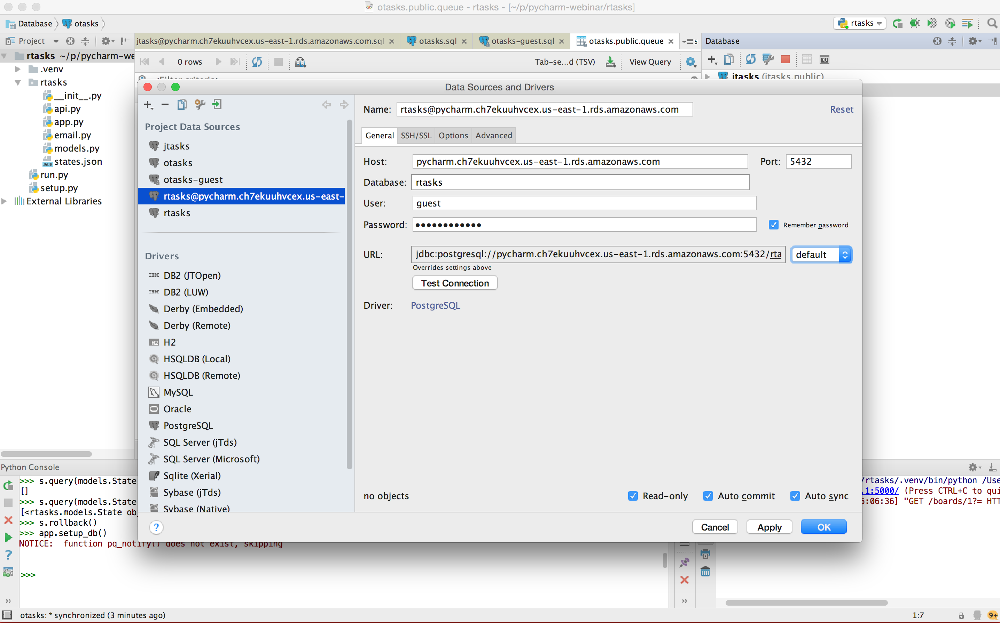

==============================================================
PyCharm Webinar: Why Postgres Should Be Your Document Database
==============================================================

with Jim Fulton, March 20, 2017

In this webinar, we'll talk about why you might use `PostgreSQL
<https://www.postgresql.org/>`_ as your document database.  We'll also
talk about transactions, why they're important, and some common
pitfalls.

As an example, we'll look at implementing a two-tiered Kanban system
using 3 approaches:

- relational,

- document oriented, and

- object oriented.

All of the examples will use the `Python programming language
<https://www.python.org/>`_.  We'll be using `PyCharm
<https://www.jetbrains.com/pycharm/>`_ to look at them.

You'll be able to follow along by looking at the databases using
database connection information that I'll share at the time of the
Webinar. (The `PyCharm database tool
<https://www.jetbrains.com/help/pycharm/2016.3/database-tool-window.html>`_
makes this especially easy.)

The first two examples are in directories in this repository:

rtasks
  A (partial) relational implementation using `Flask
  <http://flask.pocoo.org/>`_ and `SQL Alchemy
  <https://www.sqlalchemy.org/>`_.

jtasks
  A (partial) document-oriented and relational implementation also
  using `Flask <http://flask.pocoo.org/>`_ and `SQL Alchemy
  <https://www.sqlalchemy.org/>`_.

The third example looks a `two-tiered kanban
<https://github.com/zc/twotieredkanban>`_, which uses a hybrid
object-oriented and document-oriented implementation.  It uses `bobo
<http://bobo.readthedocs.io>`_ for it's web framework and `Newt DB
<http://www.newtdb.org>`_ to provide the hybrid object-oriented
document-oriented database on top of Postgres.

Following along in the database with PyCharm
============================================

You'll be able to connect to the demonstration database using PyCharm.

This screen shot shows the user interface for `adding a data source
<https://www.jetbrains.com/help/pycharm/2016.3/working-with-the-database-tool-window.html#create_data_source>`_ for this demo:

You'll use ``pycharm.ch7ekuuhvcex.us-east-1.rds.amazonaws.com`` for the host.
The password is ``charmingnewt``.

We'll be working with 3 databases:

rtasks
   for the relational implementation

jtasks
   for the JSONB (and relational) implementation and

otasks
   For the hybrid object-oriented and document oriented implementation

Links
=====

PyCharm
  https://www.jetbrains.com/pycharm/

PostgreSQL
  https://www.postgresql.org/

  PostgreSQL JSON types
    https://www.postgresql.org/docs/current/static/datatype-json.html

  PostgreSQL JSON functions and operators
    https://www.postgresql.org/docs/current/static/functions-json.html

Python
  https://www.python.org/

SQL Alchemy object-relational mapper
  https://www.sqlalchemy.org/

Newt DB, hybrid object-oriented and document-oriented database
  http://www.newtdb.org

pq, a PostgreSQL-based transactional queuing system
  https://github.com/malthe/pq/

pjpersist, an object-oriented interface to PostgreSQL.
  https://github.com/Shoobx/pjpersist

Flask web framework
  http://flask.pocoo.org/

Bobo web framework
  http://bobo.readthedocs.io

Two-tiered Kanban
  https://github.com/zc/twotieredkanban
